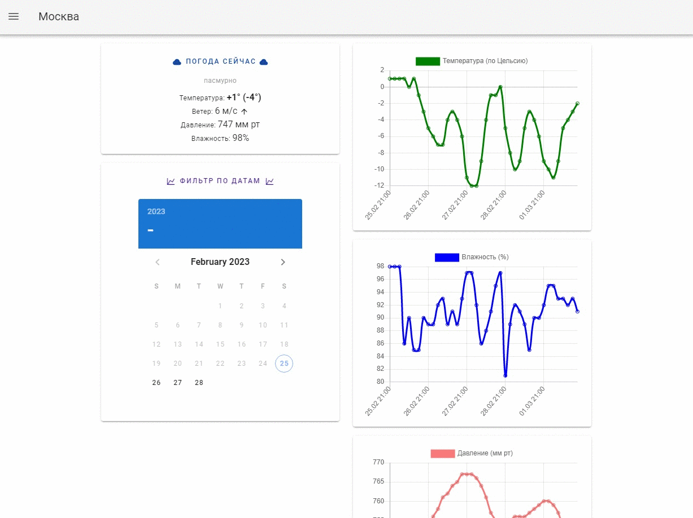

# Weather

Прогноз погоды на ближайшие 5 дней с выводом графиков температуры, влажности, давления. Данные подгружаются с openweathermap.org

## Стэк

Nuxt.js + Vuetify + Chart.js

## Как запускать?

1. `npm i` – установка необходимых пакетов
2. `npm run generate` – сборка проекта Nuxt
3. `npm run start` – запуск проекта

**Для успешного запуска требуется файл `.env`** (шаблон файла: `/.env.example`)
